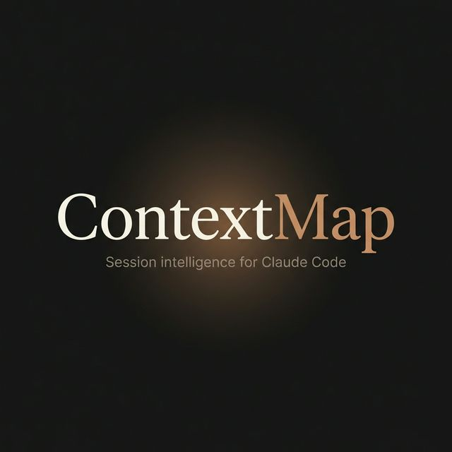

<p align="center">
  
</p>

<p align="center">
  <strong>Session intelligence for <a href="https://docs.anthropic.com/en/docs/claude-code">Claude Code</a>. Never lose your train of thought again.</strong>
</p>

<p align="center">
  <a href="https://github.com/ykai16/ContextMap/blob/master/LICENSE"></a>
  <a href="https://www.python.org/downloads/"></a>
  <a href="https://github.com/ykai16/ContextMap/stargazers"></a>
  <a href="https://github.com/ykai16/ContextMap/issues"></a>
  <a href="https://github.com/ykai16/ContextMap/commits/master"></a>
</p>

<p align="center">
  <a href="#-quick-start">Quick Start</a> · 
  <a href="#-how-it-works">How It Works</a> · 
  <a href="#-output-example">Example</a> · 
  <a href="#-configuration">Configuration</a> · 
  <a href="#-contributing">Contributing</a>
</p>

---

## 💡 The Problem

You've been coding with Claude Code for hours. You've fixed bugs, refactored modules, chased down edge cases, pivoted strategies. By the end of the session — **you've forgotten the arc of what you accomplished.**

Tomorrow, you'll open your terminal and ask yourself:

> *"Where was I? What did I decide? Why did I go down that path?"*

**ContextMap** solves this. It automatically records your Claude Code sessions and generates a beautiful HTML report that reconstructs your coding journey — showing not just *what* you did, but *why* each prompt led to the next.

## 🎯 Features

- 🔗 **Evolution Chain** — Tracks how prompts connect and evolve, showing the *intent* behind each transition
- 📊 **Rich HTML Reports** — Beautifully styled, self-contained HTML files you can open in any browser
- 🧠 **Session Narrative** — High-level bullet-point summary of each session's accomplishments
- 📍 **Context Anchor** — "Where We Left Off" section so you can resume instantly
- 🔄 **Multi-Session Tracking** — Merges history across sessions into a single evolving report
- 🎨 **Claude Code Aesthetic** — Polished dark theme inspired by Claude Code's design language
- ⚡ **Zero Friction** — Wraps your `claude` command transparently; just use Claude Code as usual

## 🚀 Quick Start

**Prerequisites:** `git`, `python3`, `pip`

```bash
# Clone the repository
git clone https://github.com/ykai16/ContextMap.git
cd ContextMap

# Run the installer
./install.sh
```

Restart your terminal or reload your shell:

```bash
source ~/.zshrc    # or source ~/.bashrc
```

That's it. Now just use `claude` as you normally would — ContextMap runs silently in the background.

## 🧠 How It Works

ContextMap wraps your `claude` command with an intelligent recording layer:

```
┌─────────────────────────────────────────────────────────┐
│  You type: claude                                        │
│                                                          │
│  1. 📄  Load previous session context                   │
│         Display "Previously on..." summary               │
│                                                          │
│  2. 🎙️  Record session transparently                    │
│         All interactions captured via script/pty          │
│                                                          │
│  3. 🧠  Analyze on exit                                 │
│         Send transcript → LLM → generate HTML report     │
│                                                          │
│  4. 📊  Save report                                     │
│         .context/session_summary.html updated             │
└─────────────────────────────────────────────────────────┘
```

### The Report Structure

Each generated HTML report contains:

| Section | Description |
| :--- | :--- |
| **Session Narrative** | Bullet-point summary of what was accomplished per session |
| **Context Anchor** | Icon-rich grid showing current state, next steps, open concerns |
| **Evolution Timeline** | Step-by-step cards with intent → expected → result + transition triggers |
| **Open Threads** | Unresolved issues, pending tasks, suggested next actions |

### What Makes It Special

Unlike simple session logs, ContextMap captures the **"why"** between prompts:

```
  Step #3: Fix N+1 query                    ✓ SUCCESS
  ├─ Intent:  Response times degraded after cache fix
  ├─ Result:  Switched to joinedload(), 200ms → 40ms
  └─ Artifacts: crud/todos.py, database.py

       ↓  "Performance resolved — shifted to pagination feature"

  Step #4: Implement cursor pagination      ✓ SUCCESS
  ├─ Intent:  Dataset expected to grow to 100k+ items
  ├─ Result:  Cursor-based with WHERE id > cursor
  └─ Artifacts: routers/todos.py, schemas/pagination.py
```

## 🖼️ Output Example

ContextMap generates a polished HTML file at `.context/session_summary.html` in your project root.

<p align="center">
  <em>Warm dark theme · Serif headers · Icon-rich layout · Click-to-expand cards</em>
</p>

The report is **100% self-contained** — no external dependencies, CDNs, or internet required. Just open it in your browser.

> 💡 **Tip:** Check out [`examples/example_report.html`](examples/example_report.html) to see a full sample report.

## ⚙️ Configuration

### API Key

Set your LLM API key in your shell profile:

```bash
# In your ~/.zshrc or ~/.bashrc
export OPENAI_API_KEY="sk-..."
```

### Environment Variables

| Variable | Description | Default |
| :--- | :--- | :--- |
| `OPENAI_API_KEY` | API key for the LLM used in analysis | *required* |
| `REAL_CLAUDE_PATH` | Path to the actual `claude` binary | auto-detected |

### File Structure

```
your-project/
├── .context/
│   ├── session_summary.html    ← The generated report
│   └── logs/                   ← Raw session logs (auto-cleaned)
└── ...
```

## 🏗️ Architecture

```
ContextMap/
├── bin/
│   ├── contextmap.py       # Core: transcript analysis + HTML generation
│   ├── wrapper.py          # PTY wrapper for transparent session recording
│   └── smart_claude.sh     # Entry point: finds claude + launches wrapper
├── examples/
│   └── example_report.html # Sample output report
└── install.sh              # One-line installer
```

| Component | Role |
| :--- | :--- |
| `smart_claude.sh` | Locates the real `claude` binary, avoids alias loops |
| `wrapper.py` | Records the session using PTY, triggers analysis on exit |
| `contextmap.py` | Parses transcripts, calls LLM, generates/merges HTML reports |

## 🤝 Contributing

Contributions are welcome! If you'd like to improve ContextMap:

1. ⭐ **Star** this repo to show your support
2. 🐛 **Report bugs** via [GitHub Issues](https://github.com/ykai16/ContextMap/issues)
3. 🔀 **Submit PRs** for improvements or new features
4. 💬 **Share feedback** on the report format or visual design

### Development

```bash
# Clone and set up
git clone https://github.com/ykai16/ContextMap.git
cd ContextMap

# Test the Python module
python3 -c "import py_compile; py_compile.compile('bin/contextmap.py', doraise=True)"

# Run the installer locally
./install.sh
```

## 📋 Roadmap

- [x] Transparent session recording via PTY
- [x] LLM-powered HTML report generation
- [x] Multi-session merge and context tracking
- [x] Evolution chain with transition triggers
- [x] Claude Code-inspired visual design
- [ ] Custom prompt templates
- [ ] Multiple LLM provider support (Anthropic, Gemini, local models)
- [ ] VS Code extension for in-editor report viewing
- [ ] Session tagging and search

## 📄 License

Copyright © 2026 [Yancy](https://github.com/ykai16). Licensed under the [MIT License](LICENSE).

---

<p align="center">
  <sub>Built with ❤️ for the Claude Code community</sub>
</p>
