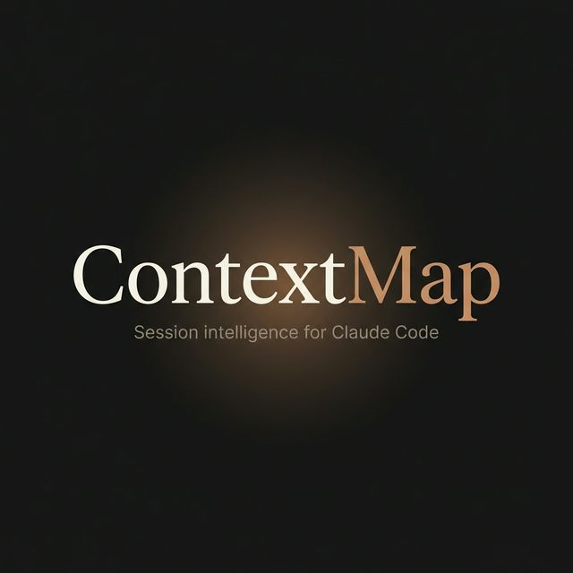

<p align="center">
  
</p>

<p align="center">
  <strong>Session intelligence for <a href="https://docs.anthropic.com/en/docs/claude-code">Claude Code</a>. Never lose your train of thought again.</strong>
</p>

<p align="center">
  <a href="https://github.com/ykai16/ContextMap/blob/master/LICENSE"></a>
  <a href="https://www.python.org/downloads/"></a>
  <a href="https://github.com/ykai16/ContextMap/stargazers"></a>
  <a href="https://github.com/ykai16/ContextMap/issues"></a>
  <a href="https://github.com/ykai16/ContextMap/commits/master"></a>
</p>

<p align="center">
  <a href="#-quick-start">Quick Start</a> · 
  <a href="#-how-it-works">How It Works</a> · 
  <a href="#%EF%B8%8F-output-example">Example</a> · 
  <a href="#%EF%B8%8F-configuration">Configuration</a> · 
  <a href="#-contributing">Contributing</a>
</p>

---

## 💡 The Problem

You've been coding with Claude Code for hours. You've fixed bugs, refactored modules, chased down edge cases, pivoted strategies. By the end of the session — **you've forgotten the arc of what you accomplished.**

Tomorrow, you'll open your terminal and ask yourself:

> *"Where was I? What did I decide? Why did I go down that path?"*

**ContextMap** solves this. It automatically records your Claude Code sessions and generates a beautiful HTML report that reconstructs your coding journey — showing not just *what* you did, but *why* each prompt led to the next.

## 🎯 Features (v1.4.0)

### ✨ Key Updates
- **v1.4.0** — Deduplication and summarization merged into a single LLM call; Claude now identifies unique prompts directly from the raw transcript. Auto-splits large logs on context-length errors (1 → 2 → 4 → 8 parts).
- **v1.3.x** — Prompt deduplication: heuristic pre-filter (v1.3.0) upgraded to LLM-verified unique prompt extraction (v1.3.1); default batch size tuned (v1.3.2).
- **v1.2.0** — Version number shown on launch; auto-updates from GitHub once per day.
- **v1.1.1** — Incremental processing for long sessions; HTML saved after each batch so progress is never lost.
- **v1.02** — Full prompt evolution tracking across the entire session.

### Core Features
- 🔗 **Evolution Chain** — Tracks how prompts connect and evolve, showing the *intent* behind each transition
- 📊 **Rich HTML Reports** — Beautifully styled, self-contained HTML files you can open in any browser
- 🧠 **Session Narrative** — High-level bullet-point summary of each session's accomplishments
- 📍 **Context Anchor** — "Where We Left Off" section so you can resume instantly
- 🔄 **Multi-Session Tracking** — Merges history across sessions into a single evolving report
- 🎨 **Claude Code Aesthetic** — Polished dark theme inspired by Claude Code's design language
- ⚡ **Zero Friction** — Wraps your `claude` command transparently; just use Claude Code as usual
- 🧩 **Long-Session Checkpoint Processing** — Automatically splits and processes long sessions in chunks; no session is too long
- 🔄 **Auto-Update** — Checks GitHub daily and updates itself automatically; always on the latest version

## 🚀 Quick Start

**Prerequisites:** `git`, `python3`, `pip`

```bash
# Clone the repository
git clone https://github.com/ykai16/ContextMap.git
cd ContextMap

# Run the installer
./install.sh
```

Restart your terminal or reload your shell:

```bash
source ~/.zshrc    # or source ~/.bashrc
```

That's it. Now just use `claude` as you normally would — ContextMap runs silently in the background.

## 🧠 How It Works

ContextMap wraps your `claude` command with an intelligent recording layer:

```
┌─────────────────────────────────────────────────────────┐
│  You type: claude                                        │
│                                                          │
│  1. 📄  Load previous session context                   │
│         Display "Previously on..." summary               │
│                                                          │
│  2. 🎙️  Record session transparently                    │
│         All interactions captured via script/pty          │
│                                                          │
│  3. 🧠  Single LLM call per part                        │
│         Claude identifies unique prompts from transcript  │
│         then builds the full context map in one pass     │
│         (auto-splits if log exceeds context limit)       │
│                                                          │
│  4. 📊  Save report                                     │
│         .context/session_summary.html updated             │
└─────────────────────────────────────────────────────────┘
```

### The Report Structure

Each generated HTML report contains:

| Section | Description |
| :--- | :--- |
| **Session Narrative** | Bullet-point summary of what was accomplished per session |
| **Context Anchor** | Icon-rich grid showing current state, next steps, open concerns |
| **Evolution Timeline** | Step-by-step cards with intent → expected → result + transition triggers |
| **Open Threads** | Unresolved issues, pending tasks, suggested next actions |

### What Makes It Special

Unlike simple session logs, ContextMap captures the **"why"** between prompts:

```
  Step #3: Fix N+1 query                    ✓ SUCCESS
  ├─ Intent:  Response times degraded after cache fix
  ├─ Result:  Switched to joinedload(), 200ms → 40ms
  └─ Artifacts: crud/todos.py, database.py

       ↓  "Performance resolved — shifted to pagination feature"

  Step #4: Implement cursor pagination      ✓ SUCCESS
  ├─ Intent:  Dataset expected to grow to 100k+ items
  ├─ Result:  Cursor-based with WHERE id > cursor
  └─ Artifacts: routers/todos.py, schemas/pagination.py
```

## 🖼️ Output Example

ContextMap generates a polished HTML file at `.context/session_summary.html` in your project root.

<p align="center">
  <em>Warm dark theme · Serif headers · Icon-rich layout · Click-to-expand cards</em>
</p>

The report is **100% self-contained** — no external dependencies, CDNs, or internet required. Just open it in your browser.

> 💡 **Tip:** Check out the [**live example report**](https://raw.githack.com/ykai16/ContextMap/master/examples/example_report.html) to see a full sample — or download [`examples/example_report.html`](examples/example_report.html) and open it locally.

## ⚙️ Configuration

### Zero Config Required

ContextMap uses the **`claude` CLI directly** for session analysis — the same Claude Code you already have installed and authenticated. No separate API key is needed.

> ✅ **If Claude Code works, ContextMap works.** It inherits your existing Claude Code authentication automatically.

### Environment Variables (Optional)

| Variable | Description | Default |
| :--- | :--- | :--- |
| `REAL_CLAUDE_PATH` | Override path to the `claude` binary (useful if you have multiple installations) | auto-detected |

### CLI Options for `contextmap.py`

You normally don't call `contextmap.py` directly — `wrapper.py` does it for you on session exit. But you can also run it manually:

```bash
python3 bin/contextmap.py <log_file> [--out PATH] [--model NAME]
```

| Option | Description | Default |
| :--- | :--- | :--- |
| `--out PATH` | Where to write the HTML report | `.context/session_summary.html` |
| `--model NAME` | Model name used in the session (informational only) | — |

> 💡 If the log exceeds the model's context window, ContextMap automatically splits it into smaller parts and retries (1 → 2 → 4 → up to 8 parts). No manual configuration needed.

### File Structure

```
your-project/
├── .context/
│   ├── session_summary.html    ← The generated report
│   └── logs/                   ← Raw session logs (auto-cleaned)
└── ...

~/.contextmap_update_cache      ← Daily update-check cache (auto-managed)
```

## 🏗️ Architecture

```
ContextMap/
├── bin/
│   ├── contextmap.py       # Core: transcript analysis + HTML generation
│   ├── wrapper.py          # PTY wrapper for transparent session recording
│   └── smart_claude.sh     # Entry point: finds claude + launches wrapper
├── examples/
│   └── example_report.html # Sample output report
└── install.sh              # One-line installer
```

| Component | Role |
| :--- | :--- |
| `smart_claude.sh` | Locates the real `claude` binary, avoids alias loops |
| `wrapper.py` | Records the session using PTY, triggers analysis on exit |
| `contextmap.py` | Parses transcripts, calls LLM, generates/merges HTML reports |

## 🤝 Contributing

Contributions are welcome! If you'd like to improve ContextMap:

1. ⭐ **Star** this repo to show your support
2. 🐛 **Report bugs** via [GitHub Issues](https://github.com/ykai16/ContextMap/issues)
3. 🔀 **Submit PRs** for improvements or new features
4. 💬 **Share feedback** on the report format or visual design

### Development

```bash
# Clone and set up
git clone https://github.com/ykai16/ContextMap.git
cd ContextMap

# Test the Python module
python3 -c "import py_compile; py_compile.compile('bin/contextmap.py', doraise=True)"

# Run the installer locally
./install.sh
```

## 📋 Roadmap

- [x] Transparent session recording via PTY
- [x] LLM-powered HTML report generation
- [x] Multi-session merge and context tracking
- [x] Evolution chain with transition triggers
- [x] Claude Code-inspired visual design
- [x] Checkpoint mechanism for long sessions (v1.1.1)
- [x] Version display on launch + auto-update from GitHub (v1.2.0)
- [x] Heuristic + LLM prompt deduplication (v1.3.x)
- [x] Single-pass LLM analysis — dedup and summarization merged into one call (v1.4.0)
- [x] Auto-split large logs on context-length errors (v1.4.0)
- [ ] Custom prompt templates
- [ ] Multiple LLM provider support (Anthropic, Gemini, local models)
- [ ] VS Code extension for in-editor report viewing
- [ ] Session tagging and search

## 📄 License

Copyright © 2026 [Yan Kai](https://github.com/ykai16). Licensed under the [MIT License](LICENSE).

---

<p align="center">
  <sub>Built with ❤️ for the Claude Code community</sub>
</p>
